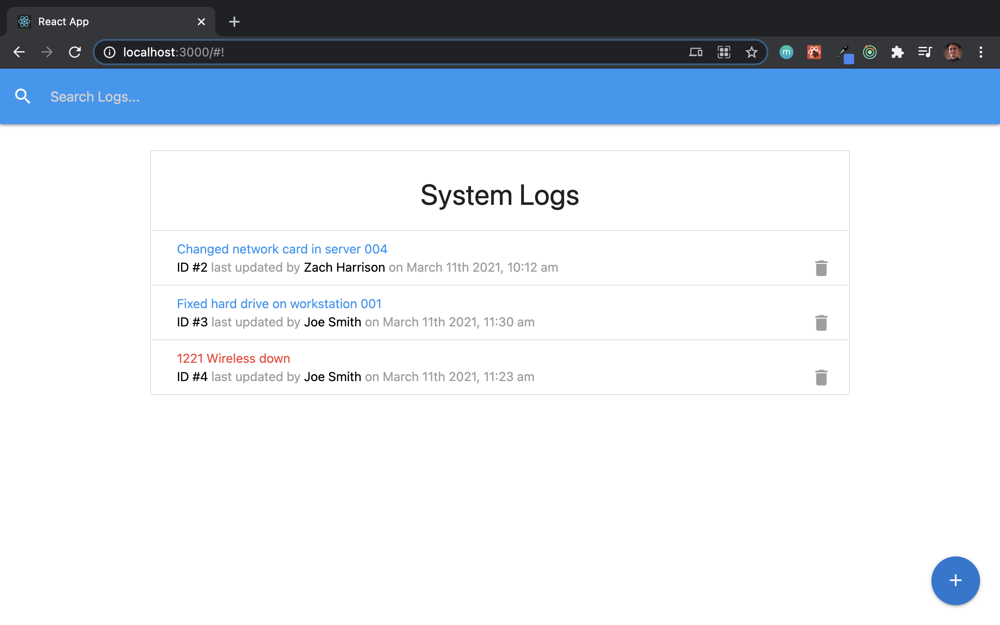
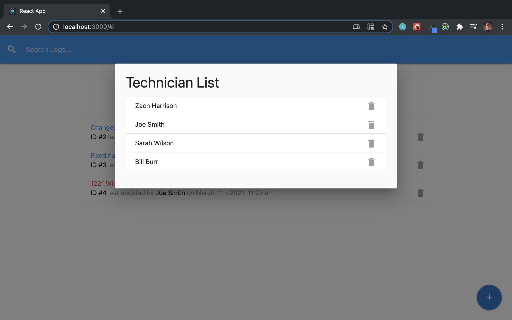
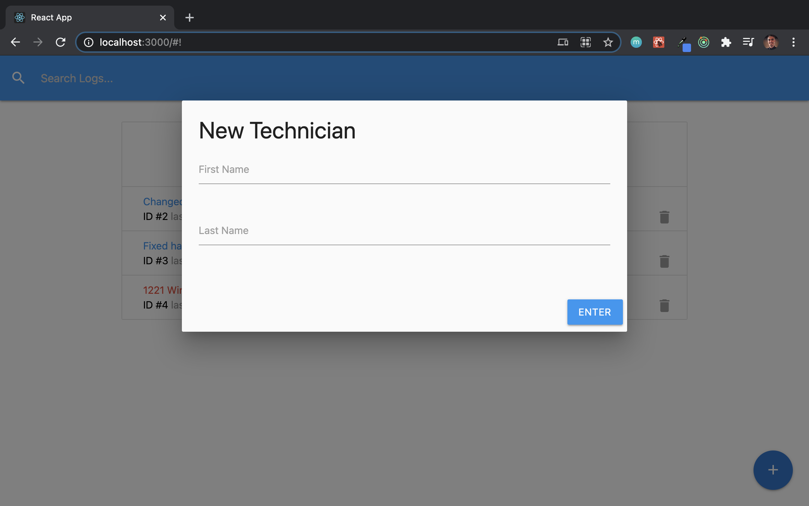
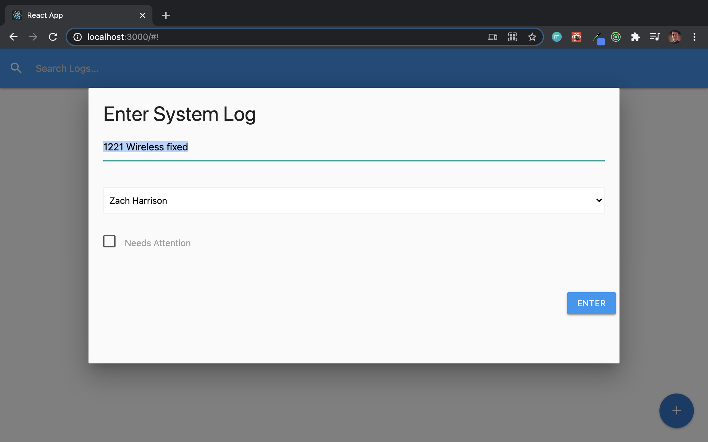

# ITLogger

> React app to track IT department tasks and issues. Uses JSON-Server as a mock backend. The frontend was built with create-react-app, Redux, and Materialize.

## App allows users to CRUD both technicians and logs

### Home page

### Technican list

### Add a new technician

### Update an existing log

## Usage

### `npm install`

### `npm run dev`

Runs the app with the backend JSON-Server 
Open [http://localhost:3000](http://localhost:3000)
Server [http://localhost:5000](http://localhost:5000)
db.json contains data

### `npm run build`

Builds the app for production to the `build` folder. 
